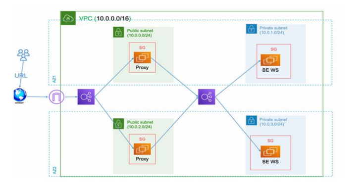

# AWS Secure Web Application with Terraform

This project provisions a secure, highly-available, and scalable multi-tier web application on AWS using Terraform. The infrastructure is designed to separate concerns, protect backend services, and ensure fault tolerance by leveraging multiple Availability Zones (AZs).

This repository contains the complete Terraform code to deploy the architecture shown in the diagram.


## 🏛️ Architecture Deep Dive

The infrastructure is logically and physically isolated within a custom VPC. Here is a breakdown of the components and the traffic flow:


### 1. Networking (VPC)
* **VPC:** A single Virtual Private Cloud (VPC) with the CIDR block `10.0.0.0/16` serves as the foundational network, isolating all resources.
* **Availability Zones:** The architecture spans **two Availability Zones** (AZ1 and AZ2) to ensure high availability and fault tolerance. If one AZ fails, the application remains accessible.
* **Subnet Tiers:** The VPC is divided into two tiers:
    * **Public Subnets:**
        * `10.0.0.0/24` (in AZ1)
        * `10.0.2.0/24` (in AZ2)
        These subnets have a route to an **Internet Gateway (IGW)**, allowing resources within them (like the public-facing load balancer and proxy servers) to be accessible from the internet.
    * **Private Subnets:**
        * `10.0.1.0/24` (in AZ1)
        * `10.0.3.0/24` (in AZ2)
        These subnets do **not** have a direct route to the internet. Resources here (the backend web servers) are completely isolated. They use a **NAT Gateway** (provisioned in the public subnets) for outbound internet access (e.g., to download software updates).

### 2. Load Balancing
* **Public Application Load Balancer (ALB):** This is the single entry point for all user traffic. It receives requests from the internet (via the "URL") and distributes them across the **Proxy** instances in the public subnets.
* **Internal Application Load Balancer (ALB):** This *second* load balancer is private. It receives traffic *only* from the Proxy instances and distributes it to the **Backend Web Servers (BE WS)** in the private subnets. This adds a layer of abstraction and scalability for the backend.

### 3. Compute
* **Proxy Tier (Public):** These are EC2 instances (likely in an Auto Scaling Group) running in the public subnets. They act as a reverse proxy (e.g., Nginx, HAProxy). Their job is to receive traffic from the public ALB and forward it to the internal ALB.
* **Backend Tier (Private):** These are the EC2 instances (also likely in an Auto Scaling Group) running the core application (BE WS). They are placed in the private subnets and can only be reached via the internal ALB, completely protecting them from direct internet exposure.

### 4. Security
* **Security Groups (SG):** This is the core of the security model, acting as a stateful firewall for each instance.
    * **Public ALB SG:** Allows inbound traffic from the internet (e.g., ports 80/443).
    * **Proxy SG:** Allows inbound traffic *only* from the Public ALB (on ports 80/443). Allows outbound traffic to the Internal ALB.
    * **Internal ALB SG:** Allows inbound traffic *only* from the Proxy instances.
    * **Backend WS SG:** Allows inbound traffic *only* from the Internal ALB (on the application port, e.g., 8080).

---

## ✨ Key Features

* **High Availability:** Deploys all critical components (ALBs, EC2 instances) across two Availability Zones.
* **Security:** Implements a multi-tier "defense-in-depth" strategy. Backend servers are fully isolated in private subnets, accessible only through multiple layers of load balancers and security groups.
* **Scalability:** Uses load balancers and can be easily configured with Auto Scaling Groups (ASGs) to automatically scale the Proxy and Backend tiers based on traffic.
* **Infrastructure as Code (IaC):** The entire environment is defined as code using Terraform, enabling automated, repeatable, and consistent deployments.

---

## 🚀 Getting Started

### Prerequisites

Before you begin, ensure you have the following tools installed and configured:
* **Terraform** (v1.0.0 or later)
* **AWS CLI**
* **An AWS Account** with configured credentials (e.g., via `aws configure`)

### 🔧 Deployment Steps

1.  **Clone the repository:**
    ```sh
    git clone [https://github.com/abdulazizelhadkah/aws-secure-webapp-terraform.git](https://github.com/abdulazizelhadkah/aws-secure-webapp-terraform.git)
    cd aws-secure-webapp-terraform
    ```

2.  **Initialize Terraform:**
    This downloads the necessary AWS provider plugins.
    ```sh
    terraform init
    ```

3.  **Review the execution plan:**
    This command shows you what resources Terraform will create, modify, or destroy.
    ```sh
    terraform plan
    ```

4.  **Apply the configuration:**
    This command will build the infrastructure in your AWS account.
    ```sh
    terraform apply
    ```
    Type `yes` when prompted to approve the plan.

After the apply is complete, Terraform will output any configured values, such as the public URL of the load balancer.

### 🧹 Clean Up

To avoid ongoing charges, you can destroy all the resources created by this project when you are finished.

```sh
terraform destroy
